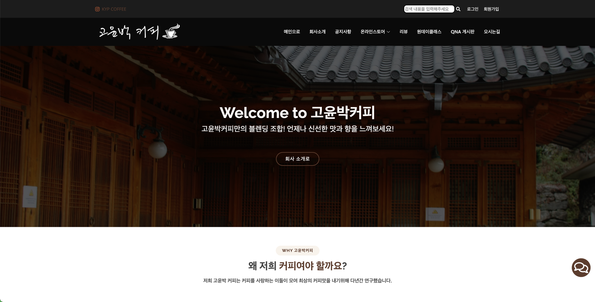

## 메인 페이지

## 유지보수
- 2022/04/11 로그인 후 로그인 관련 페이지 접속 가능
  - SessionVerification 인터셉터 추가
  - WebConfig 에 로그인 관련 url 을 preHandle 이용 접속 막기
  - log 남기기
- 2022/04/11 db 가 없을 때 view 에 아무것도 출력이 안됨
  - view 에서 null 이거나 .size() == 0 일 때 처리완료
- 2022/05/22 custom Exception
  - ApiException 클래스를 만들어서 예외처리 추가

[//]: # (- gradle build 할 때, ouath2 compile)

[//]: # (  - 1)

[//]: # (  - 2)

[//]: # (  - 3)

[//]: # (- lombok 버전 안 맞아서 build 오류)

[//]: # (  - 1)

[//]: # (  - 2)

[//]: # (  - 3)

[//]: # (- th:replace="headerFooter.html :: top-bar")

[//]: # (  - 1)

[//]: # (  - 2)

[//]: # (  - 3)