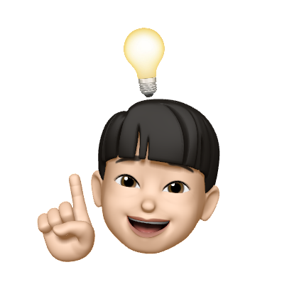
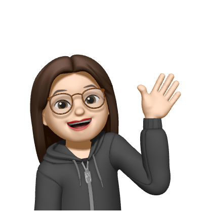
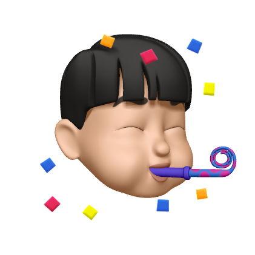

## 메인 페이지

## 주요기능
- 메인화면
  - 예를들어
  - 1
  - 2
  - 3
## 이슈
- gradle build 할 때, ouath2 compile
  - 1
  - 2
  - 3
- lombok 버전 안 맞아서 build 오류
  - 1
  - 2
  - 3
- th:replace="headerFooter.html :: top-bar"
  - 1
  - 2
  - 3

## 팀원들
</img>
박민영 팀장 예~~~~~
 
</img>
은저크 고 예~~~~~
 
</img>
우가우가 예~~~~~
 
